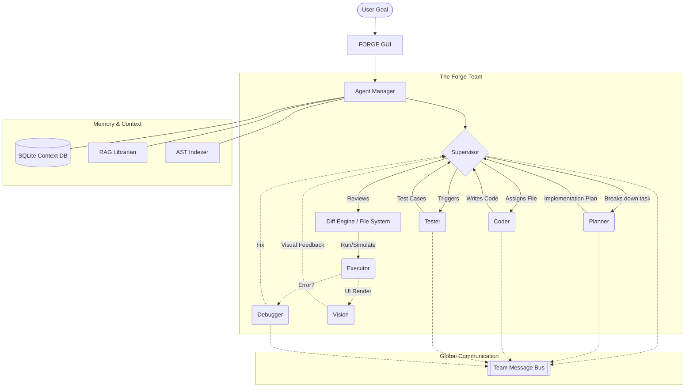

<div align="center">

# ⚒️ FORGE

**A Next-Generation Multi-Agent AI Development Studio**

[](https://www.python.org/downloads/)
[](https://opensource.org/licenses/MIT)
[](https://ollama.com/)
[]()

<p align="center">
  
  &nbsp;
  
  &nbsp;
  
</p>

[Features](#-features) • [Installation](#-installation) • [The Agent Team](#-the-agent-team) • [Architecture](#-architecture) • [Storage Settings](#-storage-management)

</div>

---

## ⚡ What is FORGE?

**FORGE** is a locally-hosted, multi-agent AI development environment. Instead of relying on a single language model to write code, FORGE deploys an entire **collaborative engineering team** to build, debug, test, and verify your projects autonomously.

Designed for raw power and privacy, FORGE runs cutting-edge models (Qwen 27B, DeepSeek-R1 8B, Qwen2.5-VL) locally on your hardware via `AirLLM` and `Ollama`, orchestrated through a beautiful `CustomTkinter` GUI.

<br>

<div align="center">
  
</div>

<br>

## 🚀 Features

- 🧠 **7 Specialized Agents:** An autonomous team including an Architect, Planner, Coder, Debugger, Vision Analyst, Tester, and Auditor.
- 🚌 **Team Bus Communication:** Agents don't work in silos. They communicate over a shared message bus, seeing what their teammates have produced and reacting intelligently.
- 🖥️ **Live Render Simulator:** Watch your apps (web/UI) render in real-time within the IDE.
- 💾 **Visual Storage Manager:** Out of C: drive space? Move heavy ML models, databases, and projects to any drive via the graphical settings menu.
- 🔍 **Live Diagnostics:** Monitor VRAM usage, token throughput, context limits, and active threads in real-time.
- 🗄️ **Persistent Context:** Every project maintains an SQLite vector database, allowing the team to remember past decisions and codebase structures.

---

## 🤖 The Agent Team

FORGE coordinates 7 specialized AI agents to execute your goals.

| Agent | Role | Recommended Model | Engine |
|-------|------|-------------------|--------|
| **👑 SUPERVISOR** | Overall architecture, task routing, and final code review before writing to disk. | `Qwen 27B` | AirLLM |
| **📝 PLANNER** | Decomposes goals into logical, sequential implementation steps. | `DeepSeek-R1 8B` | Ollama |
| **💻 CODER** | Writes and modifies code based on the implementation plan. | `Qwen 27B` | AirLLM |
| **🐛 DEBUGGER** | Performs static analysis and fixes runtime errors. | `DeepSeek-R1 8B` | Ollama |
| **👁️ VISION** | Analyzes simulator screenshots to ensure UI/UX matches expectations. | `Qwen2.5-VL 7B` | Ollama |
| **🧪 TESTER** | Generates unit tests for newly implemented code. | `DeepSeek-R1 8B` | Ollama |
| **⚖️ AUDITOR** | An independent API-driven model (Gemini) that occasionally steps in to break stalemates and ensure code quality. | `Gemini 2.5 Flash` | API |

---

## 🏗️ Architecture



---

## 🛠️ Installation

### 1. Requirements

- **Windows 10/11**
- **Python 3.10+** (Make sure to check "Add Python to PATH")
- **Ollama** installed and running (`ollama serve`)

### 2. Setup

Clone the repository and run the setup script:

```bash
git clone https://github.com/yourusername/FORGE.git
cd FORGE
python setup.py
```

`setup.py` will:
1. Create a **Desktop Shortcut** (`FORGE.lnk`).
2. Add FORGE to your **Start Menu**.
3. Generate the application icon.

### 3. Launch

Simply double-click the **FORGE shortcut on your Desktop**.
The launcher (`Launch FORGE.bat`) will automatically detect your Python installation, install required dependencies (`pip install -r requirements.txt`), and launch the studio.

For detailed model downloading instructions and PyInstaller packaging, refer to [INSTALL.md](INSTALL.md).

---

## 💾 Storage Management

Machine learning models are huge. FORGE includes a built-in **Storage Manager** to keep your primary drive clean.

1. Open FORGE and click **⚙️ SETTINGS**.
2. Navigate to the **💾 Storage** tab.
3. Click **📂 Open Storage Settings...**
4. Re-route your HuggingFace Cache, Ollama Models, and Projects to a secondary drive (e.g., `D:\FORGE_Data\models`).

*Changes persist automatically in `%APPDATA%/FORGE/settings.json`.*

---

## 🤝 Contributing

Contributions are welcome! Please feel free to submit a Pull Request.

1. Fork the Project
2. Create your Feature Branch (`git checkout -b feature/AmazingFeature`)
3. Commit your Changes (`git commit -m 'Add some AmazingFeature'`)
4. Push to the Branch (`git push origin feature/AmazingFeature`)
5. Open a Pull Request

---

<div align="center">
  <p>Built with 💻 and ☕</p>
</div>
